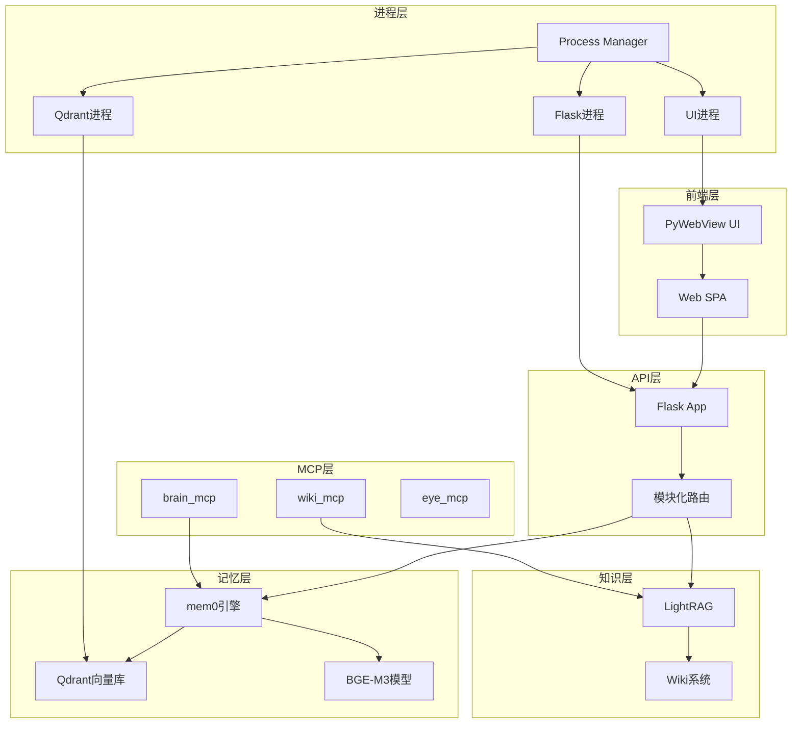

# AiBrain 项目结构图

## 整体目录结构

```
AiBrain/
├── backend/                    # 后端核心代码
│   ├── core/                  # 核心模块
│   │   ├── database.py        # SQLite 数据库管理
│   │   ├── logger.py          # 日志系统
│   │   ├── model.py           # 模型加载管理
│   │   └── settings.py        # 配置管理
│   ├── launcher/             # 进程启动管理
│   │   ├── process_manager.py # 统一进程管理器
│   │   ├── start_flask.py     # Flask独立启动
│   │   ├── kill_old.py        # 清理旧进程
│   │   └── _boot_helper.py    # 启动辅助
│   ├── modules/              # 功能模块
│   │   ├── brain/            # 记忆核心模块
│   │   │   ├── memory.py     # 记忆核心逻辑
│   │   │   ├── mem0_adapter.py # mem0适配器
│   │   │   ├── organizer.py  # 记忆整理
│   │   │   ├── dedup.py      # 去重功能
│   │   │   └── migrate.py    # 数据迁移
│   │   ├── status.py         # 系统状态
│   │   ├── memory.py         # 记忆API
│   │   ├── wiki_mod.py       # Wiki功能
│   │   ├── settings_mod.py   # 设置管理
│   │   ├── stats.py          # 统计功能
│   │   └── stream.py         # 活动流
│   ├── app.py                # 主应用入口
│   └── main.py               # MCP服务入口
├── brain_mcp/                # 记忆MCP服务
│   ├── server.py             # MCP服务器
│   ├── tools.py              # MCP工具定义
│   ├── embedding.py          # 嵌入模型接口
│   └── config.py             # 配置管理
├── mcp_servers/              # 其他MCP服务
│   ├── wiki_mcp/             # Wiki知识库服务
│   ├── eye_mcp/              # 屏幕截图服务
│   ├── console_mcp/          # 控制台服务
│   └── computer_mcp/         # 计算机操作服务
├── rag/                      # RAG知识库系统
│   └── lightrag_wiki/        # LightRAG实现
│       ├── rag_engine.py     # RAG引擎核心
│       ├── indexer.py        # 文档索引
│       └── config.py         # 配置管理
├── web/                      # 前端Web界面
│   ├── index.html            # 主页面
│   ├── main.js               # 主逻辑
│   └── modules/              # 功能模块
│       ├── overview/         # 总览页面
│       ├── memory/           # 记忆管理
│       ├── steam/            # 活动流
│       ├── wiki/             # 知识库
│       ├── settings/         # 设置页面
│       └── logs/             # 日志查看
├── wiki/                     # Wiki文档目录
│   ├── project/              # 项目文档
│   │   ├── AiBrain架构.md
│   │   ├── AiBrain架构详细分析.md
│   │   ├── LightRAG调研.md
│   │   ├── 启动架构.md
│   │   ├── 前端-overview模块.md
│   │   ├── 前端-memory模块.md
│   │   ├── 前端-steam模块.md
│   │   ├── 前端-wiki模块.md
│   │   ├── 前端-settings模块.md
│   │   └── 项目结构图.md
│   ├── local/                # 本地文档
│   └── unity/                # Unity相关文档
│       └── shader阴影.md
├── models/                   # 模型文件目录
│   └── bge-m3/               # BGE-M3模型
├── qdrant/                   # 向量数据库
│   ├── storage/              # 数据存储
│   ├── config/               # 配置文件
│   └── qdrant.exe            # Qdrant可执行文件
├── logs/                     # 日志目录
├── snapshots/                # 数据快照
├── tests/                    # 测试代码
├── venv312/                  # Python虚拟环境
└── 根目录配置文件
    ├── start.bat             # Windows启动脚本
    ├── start.py              # Python启动脚本
    ├── launch.py             # 高级启动器
    ├── server.py             # 测试服务器
    ├── requirements.txt      # Python依赖
    ├── settings.json         # 应用设置
    ├── .mcp.json             # MCP配置
    ├── .port_config          # 端口配置
    └── SETUP.md              # 安装说明
```

## 核心模块依赖关系



## 数据流架构

### 记忆存储流程
```
用户输入 → 前端UI → Flask API → mem0引擎 → BGE-M3嵌入 → Qdrant存储
```

### 记忆搜索流程
```
用户查询 → 前端UI → Flask API → mem0引擎 → 自适应策略 → Qdrant检索 → 结果排序 → 返回前端
```

### 知识检索流程
```
用户查询 → 前端UI → Flask API → LightRAG引擎 → 多模式搜索 → 结果融合 → 返回前端
```

### MCP调用流程
```
外部工具 → MCP协议 → MCP服务 → 内部API → 业务逻辑 → 返回结果
```

## 进程架构图

```
启动流程:
start.bat/start.py
    ↓
process_manager.py (主进程)
    ├── qdrant.exe (向量数据库进程)
    │   └── 监听: HTTP端口, gRPC端口
    ├── python app.py --flask-only (API服务进程)
    │   └── 监听: Flask端口
    └── python app.py --webview-only (UI服务进程)
        └── 显示: PyWebView窗口
```

## 端口分配架构

```
动态端口分配机制:
1. 基于项目路径计算哈希值
2. 从基础端口(18765)开始偏移
3. 分配三个连续端口:
   - Flask API端口
   - Qdrant HTTP端口
   - Qdrant gRPC端口
4. 避免端口冲突，支持多实例运行
```

## 配置文件架构

```
配置层级:
1. 环境变量 (最高优先级)
   - FLASK_PORT, QDRANT_HTTP_PORT等
2. 项目配置文件
   - .port_config (端口配置)
   - settings.json (应用设置)
3. 用户配置文件
   - ~/.aibrain/config/ (用户偏好)
4. 模型配置文件
   - models/bge-m3/ (模型配置)
5. 数据库配置文件
   - qdrant/config/config.yaml (Qdrant配置)
```

## 扩展性设计

### 添加新功能模块
1. 在 `backend/modules/` 创建新模块
2. 在 `app.py` 中注册路由
3. 在前端 `web/modules/` 添加对应UI

### 添加新MCP服务
1. 在 `mcp_servers/` 创建新服务
2. 实现MCP工具接口
3. 更新 `.mcp.json` 配置

### 添加新知识源
1. 在 `wiki/` 添加文档
2. 通过LightRAG索引
3. 通过Wiki API访问

## 关键文件说明

### 启动相关
- `start.bat`: Windows主启动脚本
- `start.py`: Python等效启动脚本
- `launch.py`: 高级启动器，支持多种启动方式
- `backend/launcher/process_manager.py`: 统一进程管理器

### 核心入口
- `backend/app.py`: Flask主应用入口
- `brain_mcp/server.py`: 记忆MCP服务入口
- `mcp_servers/wiki_mcp/server.py`: Wiki MCP服务入口

### 配置管理
- `settings.json`: 应用全局设置
- `.port_config`: 动态端口配置
- `.mcp.json`: MCP工具配置
- `~/.aibrain/config/`: 用户配置目录

### 数据存储
- `qdrant/storage/`: 向量数据库数据
- `rag/lightrag_data/`: LightRAG索引数据
- `backend/stats.db`: SQLite统计数据
- `logs/`: 系统日志文件

## 开发工作流

### 前端开发
1. 修改 `web/` 目录下的文件
2. 刷新浏览器或重启应用查看更改

### 后端开发
1. 修改 `backend/` 目录下的Python文件
2. ProcessManager支持热重载（设置FLASK_RELOAD=1）
3. 或手动重启Flask进程

### MCP开发
1. 在 `mcp_servers/` 创建新服务
2. 测试MCP工具调用
3. 更新配置后重新加载

### 文档更新
1. 在 `wiki/` 目录添加或修改Markdown文件
2. 通过Web界面重建索引
3. 通过MCP工具搜索测试